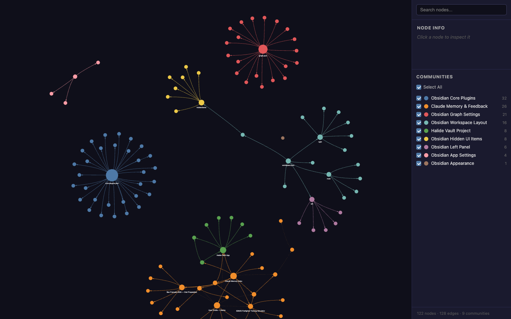

# Claude Memory Graph

A graph view of Claude Code's persistent memory and the Obsidian vault that syncs it: which files exist, how they link together, and which topics cluster into communities.

**[Explore the graph →](https://sacha9214.github.io/claude-memory-graph/)**



## Contents

| File | Role |
|---|---|
| `graph.json` | The graph: 122 nodes, 128 edges, 9 communities |
| `GRAPH_REPORT.md` | Summary: most connected nodes, communities, inferred links |
| `index.html` | Interactive view: search, per-node details, community filters |
| `vis-network.min.js` | [vis-network](https://github.com/visjs/vis-network) rendering library, served locally |

Snapshot from May 31, 2026, generated with graphify.

## Run locally

```bash
python3 -m http.server 8000
# then open http://localhost:8000
```

## License

[MIT](LICENSE). `vis-network.min.js` keeps its own license (Apache-2.0 or MIT).
